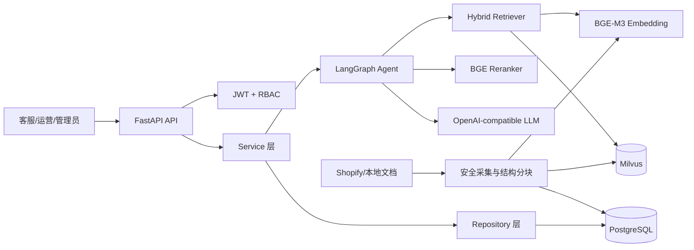
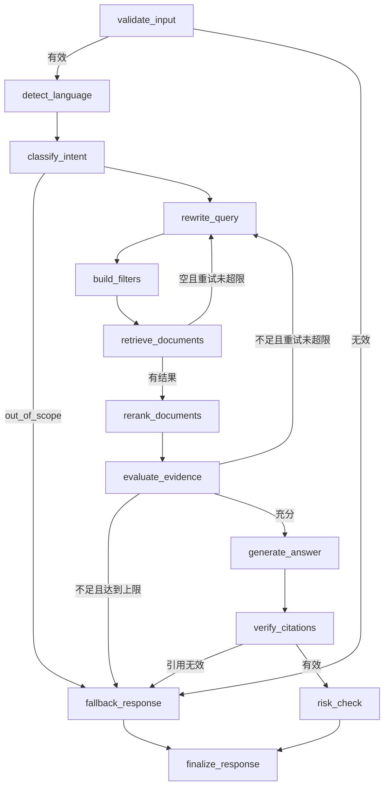

# TraceCommerce RAG Agent

[](https://github.com/wangjie2617-glitch/tracecommerce-rag-agent/actions/workflows/ci.yml)
[](https://www.python.org/)
[](https://react.dev/)
[](LICENSE)

面向跨境电商客服与运营的可追溯 RAG Agent 系统。

系统使用 Shopify 官方简体中文帮助中心作为第一版企业知识库，以中文问答和中文检索为默认链路，并实现 LangGraph 条件编排、无证据回退、真实引用、请求追踪、JWT/RBAC、PostgreSQL 和 Milvus 混合检索。

> 本项目是求职工程实践。它使用公开 Shopify 帮助文档，不代表 Shopify 官方产品，也不提供法律、税务或海关专业意见。

中文检索采用以下策略：

- 知识库正文、标题和语言元数据统一使用 `zh-CN`
- 常见客服表达先归一化，例如“退钱”映射为“退款”、“快递”扩展为“物流/配送”
- 离线模式使用中文二元、三元词片完成 Dense 与 Sparse 检索
- 中文 Query 默认增加 `language=zh-CN` Metadata Filter，避免混入旧英文向量
- 真实模型模式可切换到 BGE-M3 和 BGE Reranker

## 1. 业务背景

跨境电商客服和运营问题经常同时涉及物流、关税、VAT、本地货币、支付、退款和市场规则。通用大模型可能依赖过期知识或编造规则，因此本项目要求每个结论都能够追溯到企业公开知识库。

每次回答返回：

- 最终答案、证据匹配分 `evidence_score`、证据等级 `evidence_level` 和 `grounded`
- 文档标题、章节、原始 URL 和采集时间
- 来自真实 Chunk 的 `quoted_text`
- Dense/BM25 混合检索分数和 Rerank 分数
- `request_id`、`thread_id`
- LangGraph 节点执行轨迹和风险提示

证据不足时固定回答：

```text
当前知识库中没有足够的信息支持该结论。
```

## 2. 系统架构



## 3. LangGraph 工作流



最多重新检索两次。开发模式使用 `InMemorySaver` 保存线程级短期状态，生产结构预留 PostgreSQL Checkpointer 替换点。

## 4. 技术栈

- Python 3.11+
- FastAPI、Uvicorn、Pydantic v2、pydantic-settings
- LangChain、LangGraph
- PostgreSQL、SQLAlchemy 2.x、Alembic
- Milvus、pymilvus、Dense + BM25 Sparse Hybrid Search
- BAAI/bge-m3、BAAI/bge-reranker-v2-m3
- OpenAI-compatible LLM（OpenAI、DeepSeek、本地兼容服务）
- JWT、bcrypt、RBAC
- Docker、Docker Compose
- pytest、httpx、Ruff

## 5. 目录结构

```text
02-enterprise-rag-agent/
├── backend/
│   ├── app/
│   │   ├── api/v1/              # Auth、Chat、知识源、文档、追踪、系统接口
│   │   ├── agents/              # AgentState、LangGraph、节点
│   │   ├── core/                # 安全、日志、异常、中间件
│   │   ├── db/models/           # SQLAlchemy 模型
│   │   ├── ingestion/           # 白名单爬虫、文件解析、导入管线
│   │   ├── rag/                 # Embedding、Rerank、检索、证据、引用
│   │   ├── repositories/        # PostgreSQL 数据访问
│   │   ├── schemas/             # Pydantic 请求和响应
│   │   ├── services/            # 业务编排
│   │   └── vectorstores/        # Milvus 与内存适配器
│   ├── alembic/                 # 数据库迁移
│   ├── data/                    # Shopify 官方短原文启动集
│   ├── scripts/                 # 初始化、导入和采集验证脚本
│   ├── tests/                   # 单元与集成测试
│   ├── Dockerfile
│   └── pyproject.toml
├── frontend/
│   ├── src/                     # React 页面、接口封装与类型定义
│   ├── package.json             # Vite 开发和构建命令
│   └── vite.config.ts           # 本地 API 代理
├── docs/architecture.md
├── docker-compose.yml
├── .env.example
└── Makefile
```

## 6. 环境要求

- Windows 10/11、Python 3.11 或 3.12
- Node.js 20+、npm 10+（运行前端）
- Docker Desktop 只负责运行 PostgreSQL 与 Milvus，FastAPI 在本机运行
- 推荐至少 8GB 内存
- 使用 BGE-M3/Reranker 时建议 16GB 内存或可用 GPU
- 本项目已经在 PostgreSQL 15、Milvus 2.4.0、Python 3.12 上完成端到端验证

## 7. 环境变量

复制示例：

```powershell
Copy-Item .env.example .env
```

关键配置：

| 环境变量 | 作用 |
|---|---|
| `DATABASE_URL` | PostgreSQL/SQLite 异步连接 |
| `JWT_SECRET_KEY` | JWT 签名密钥，生产必须更换 |
| `MILVUS_URI` | Milvus 地址 |
| `VECTOR_STORE_PROVIDER` | 本地真实联调使用 `milvus`，测试可用 `memory` |
| `LLM_PROVIDER` | `openai_compatible` 或 `fake` |
| `LLM_MODEL/BASE_URL/API_KEY` | OpenAI-compatible 模型配置 |
| `EMBEDDING_PROVIDER` | `sentence_transformers` 或 `fake` |
| `EMBEDDING_MODEL` | 默认 `BAAI/bge-m3` |
| `RERANKER_PROVIDER` | `cross_encoder` 或 `mock` |
| `RERANKER_MODEL` | 默认 `BAAI/bge-reranker-v2-m3` |
| `MIN_RETRIEVAL_SCORE` | 向量召回最低分；必须针对当前 Embedding 和 Collection 调整 |
| `MIN_EVIDENCE_SCORE` | 证据充分性阈值；必须通过评测集标定 |
| `SHOPIFY_ALLOWED_PREFIXES` | Shopify 抓取白名单 |
| `CRAWLER_DELAY_SECONDS` | 请求间隔，实际最少 1 秒 |
| `CRAWLER_MAX_PAGES/DEPTH` | 页面和深度上限 |

仓库中的本地 `.env` 已连接本机 Docker 里的 PostgreSQL 和 Milvus，同时使用
FakeLLM/FakeEmbedding/MockReranker，便于零 API Key 运行。需要展示真实模型时，再切换
`LLM_PROVIDER`、`EMBEDDING_PROVIDER` 和 `RERANKER_PROVIDER`。

> `FakeEmbedding` 和 `MockReranker` 只用于离线联调，分数不能解释为答案正确概率。
> API 中的 `evidence_score` 是当前检索与精排链路的启发式证据匹配分，
> `confidence` 仅为兼容旧客户端而保留。

## 8. Windows/PyCharm 本地启动

### 8.1 PyCharm 解释器

选择：

```text
backend\.venv\Scripts\python.exe
```

Working directory 必须设置为：

```text
<仓库路径>\backend
```

### 8.2 启动现有数据库服务

项目不会在 Docker 中运行后端，只启动你电脑上已有的四个基础服务：

```powershell
docker start edu_agent_postgres edu_agent_etcd edu_agent_minio edu_agent_milvus
```

当前本地连接：

```text
PostgreSQL: localhost:5433 / database=tracecommerce
Milvus:     localhost:19531 / collection=tracecommerce_chunks_zh_cn
```

### 8.3 一键初始化并启动

在 PowerShell 中：

```powershell
cd backend
powershell -ExecutionPolicy Bypass -File .\scripts\start_local.ps1
```

脚本会依次执行数据库迁移、管理员初始化、Milvus 初始化、Shopify 启动数据导入，
然后在本机启动 Uvicorn。也可以在 PyCharm Terminal 中逐条运行：

```powershell
.\.venv\Scripts\alembic.exe upgrade head
.\.venv\Scripts\python.exe scripts\seed_admin.py
.\.venv\Scripts\python.exe scripts\init_milvus.py
.\.venv\Scripts\python.exe scripts\ingest_bootstrap.py
.\.venv\Scripts\uvicorn.exe app.main:app --host 127.0.0.1 --port 8000 --reload
```

本地地址：

- API：<http://localhost:8000>
- Swagger：<http://localhost:8000/docs>
- Health：<http://localhost:8000/health>
- Ready：<http://localhost:8000/ready>

### 8.4 PyCharm Run Configuration

选择 `Python` 类型，Module name 填 `uvicorn`，Parameters 填
`app.main:app --host 127.0.0.1 --port 8000 --reload`，解释器与 Working directory
使用上面的值。运行后访问 Swagger。

### 8.5 启动可视化前端

保持 FastAPI 的 `8000` 端口正在运行，再打开一个 PyCharm Terminal：

```powershell
cd frontend
npm install
npm run dev
```

访问 <http://localhost:3000>。Vite 会将 `/api` 和 `/ready` 请求代理到
`http://127.0.0.1:8000`，因此本地开发不需要额外配置跨域。

管理员账户由根目录 `.env` 中的以下变量设置：

```text
ADMIN_EMAIL=admin@example.com
ADMIN_PASSWORD=<设置一个仅用于本地开发的强密码>
```

前端提供中文问答、证据引用、对话记录、知识库文档管理、文件上传、
知识源同步和 LangGraph 请求追踪。详细说明见 `frontend/README.md`。

## 9. 数据库迁移与管理员

```powershell
cd backend
.\.venv\Scripts\alembic.exe upgrade head
.\.venv\Scripts\python.exe scripts\seed_admin.py
```

开发账户来自环境变量：

```text
ADMIN_EMAIL=admin@example.com
ADMIN_PASSWORD=<设置一个仅用于本地开发的强密码>
```

首次启动后必须更换密码和 JWT Secret。

数据库包含：

```text
users, roles, user_roles, knowledge_sources, documents,
document_versions, ingestion_jobs, conversations, messages,
rag_requests, retrieval_records, citations, agent_traces,
answer_feedback, audit_logs
```

## 10. Shopify 知识库导入

### 离线官方启动数据

`backend/data/shopify_bootstrap.json` 保存 11 条 Shopify 官方中文页面摘要、中文标题和真实 URL，
覆盖市场、税费、退换货、关税、定价、支付、订单跟踪和订单状态，用于无网络验收：

```powershell
cd backend
.\.venv\Scripts\python.exe scripts\ingest_bootstrap.py
```

### 合规网页同步

```powershell
cd backend
.\.venv\Scripts\python.exe scripts\ingest_shopify.py
```

采集器：

- 只允许 `help.shopify.com` 配置白名单
- 读取并遵守 robots.txt
- 使用明确 User-Agent
- 拒绝私网、回环、非 HTTPS 和白名单外重定向
- 超时、最多重试 3 次、最少 1 秒间隔
- 最大页数和最大深度
- 通过 SHA-256 判断增量变化

如果 Shopify 返回 403/验证码/登录限制，系统会停止并记录失败，不会绕过限制。此时可以使用启动数据或上传经过授权的企业文档。

## 11. 本地文件导入

支持：

- PDF
- TXT
- Markdown
- HTML
- DOCX

文件限制：

- 默认最大 10MB
- 扩展名白名单
- HTML 去除脚本、导航和样式
- 按标题、章节、段落和列表进行结构化分块

通过 Swagger 调用：

```text
POST /api/v1/documents/upload
```

## 12. Milvus Collection

Collection 默认名称：

```text
tracecommerce_chunks_zh_cn
```

主要字段：

```text
chunk_id, document_id, source_id, company_name, source_type,
title, section_title, source_url, content, language,
country_or_region, business_category, version, is_active,
crawled_at, dense_vector, sparse_vector
```

向量维度从 Embedding Provider 运行时读取。Dense 使用 HNSW/COSINE，检索使用
`WeightedRanker(0.7, 0.3)`。适配器会检测 Milvus 版本：2.5+ 使用内置 BM25 Function；
当前本机 Milvus 2.4 使用客户端生成的确定性词法 Sparse Vector 和 IP 稀疏索引。

Metadata Filter 只允许：

```text
company_name, language, country_or_region, business_category,
source_type, is_active, version
```

## 13. API 示例

### 登录

```bash
curl -X POST http://localhost:8000/api/v1/auth/login \
  -H "Content-Type: application/json" \
  -d '{"email":"YOUR_ADMIN_EMAIL","password":"YOUR_ADMIN_PASSWORD"}'
```

### 发起问答

```bash
curl -X POST http://localhost:8000/api/v1/chat/query \
  -H "Authorization: Bearer YOUR_TOKEN" \
  -H "Content-Type: application/json" \
  -d '{"query":"Shopify 跨境订单的 HS code 有什么要求？"}'
```

返回核心结构：

```json
{
  "success": true,
  "request_id": "uuid",
  "data": {
    "request_id": "uuid",
    "thread_id": "uuid",
    "answer": "根据检索到的 Shopify 官方资料……",
    "evidence_score": 0.68,
    "evidence_level": "high",
    "confidence": 0.68,
    "grounded": true,
    "intent": "duties_and_taxes",
    "language": "zh-CN",
    "citations": [
      {
        "document_id": "uuid",
        "chunk_id": "uuid",
        "title": "Duties and import taxes",
        "source_url": "https://help.shopify.com/...",
        "quoted_text": "真实检索片段",
        "retrieval_score": 0.82,
        "rerank_score": 0.91,
        "crawled_at": "ISO datetime"
      }
    ],
    "trace": [],
    "warnings": []
  }
}
```

`confidence` 已弃用，暂时保留是为了不破坏旧前端；新代码应读取
`evidence_score` 和 `evidence_level`。其中分数只衡量检索证据的相对匹配程度，
不是“答案有 68% 概率正确”。

### 查询追踪

```text
GET /api/v1/traces/{request_id}
GET /api/v1/traces/{request_id}/citations
```

其他核心接口：

```text
GET/POST/PATCH /api/v1/users
GET/POST/PATCH/DELETE /api/v1/knowledge-sources
POST /api/v1/knowledge-sources/{source_id}/sync
GET /api/v1/knowledge-sources/jobs
GET /api/v1/knowledge-sources/jobs/{job_id}
GET/POST/DELETE /api/v1/documents
GET /api/v1/chat/conversations
POST /api/v1/chat/feedback
```

## 14. Swagger 使用

1. 访问 <http://localhost:8000/docs>。
2. 调用 `/api/v1/auth/login` 获取 Access Token。
3. 点击 Swagger 右上角 `Authorize`。
4. 输入 `Bearer <token>`。
5. 调用知识源、文档、Chat 和追踪接口。

## 15. 可追溯机制

引用不是由 LLM 生成。系统从 Rerank 后的真实 `RetrievedDocument.content` 截取 `quoted_text`，再校验：

- `chunk_id` 必须属于本次检索结果
- `quoted_text` 必须是该 Chunk 的原文子串
- `source_url` 必须与 Chunk 元数据一致
- 无引用、伪造片段或 URL 不一致时进入 fallback

LLM Prompt 将文档声明为“不可信参考资料”，知识库内容不能覆盖系统指令。

## 16. 测试

本地：

```powershell
cd backend
.\.venv\Scripts\pytest.exe -p no:cacheprovider
.\.venv\Scripts\ruff.exe check app scripts tests --no-cache
```

验证真实本地 PostgreSQL、Milvus、Agent、引用和拒答链路：

```powershell
.\.venv\Scripts\python.exe scripts\smoke_local.py
```

运行离线检索评测并生成 JSON/Markdown 报告：

```powershell
cd backend
.\.venv\Scripts\python.exe scripts\evaluate_rag.py
```

评测集位于 `backend/data/evaluation/rag_eval.jsonl`，同时包含可回答问题和必须拒答的问题。
报告会给出 Hit@K、MRR、无答案误放行数以及满足默认 95% Precision 约束的推荐证据阈值。
该阈值只对当前模型、Collection 和知识版本有效。
当前离线基线见 `backend/reports/rag_evaluation_offline.md`。

首次切换到真实 BGE 检索链路时，使用：

```powershell
.\scripts\prepare_real_models.ps1 -Device cpu
```

脚本使用 `BAAI/bge-m3`、`BAAI/bge-reranker-v2-m3` 和独立 Collection
`tracecommerce_chunks_bge_m3_v1`，依次初始化、重建索引并执行评测。
首次运行需要联网下载模型；如果只想先重建索引，可加 `-SkipEvaluation`。

测试覆盖：

- bcrypt、JWT
- 结构化分块
- Query 改写和意图分类
- Metadata Filter
- 引用构建与伪造引用拒绝
- 证据充分性
- 证据等级、阈值 Precision/Recall/F1 标定
- 文档导入、内容哈希和增量版本
- 注册、登录、RBAC
- RAG 有证据回答和无证据 fallback
- LangGraph 分支和两次重试
- 可选真实 Milvus 健康检查

运行真实 Milvus 条件测试：

```powershell
$env:MILVUS_TEST_URI="http://localhost:19530"
pytest -m milvus
```

## 17. 结构化日志与安全

请求日志包含：

```text
timestamp, level, request_id, thread_id, user_id,
path, method, status_code, duration_ms, agent_node, error_code
```

系统不会主动记录密码、JWT、API Key。已实现：

- bcrypt 密码哈希
- JWT Access Token
- RBAC
- Pydantic 参数校验
- URL 白名单和 SSRF 防护
- 上传类型和大小限制
- SQLAlchemy 参数化查询
- Prompt Injection 基础检测
- 文档/系统指令隔离
- 引用校验
- CORS 配置

## 18. 常见错误

### `/ready` 返回 `not_ready`

检查 PostgreSQL 和 Milvus：

```powershell
docker ps --filter "name=edu_agent_"
docker start edu_agent_postgres edu_agent_etcd edu_agent_minio edu_agent_milvus
```

### `LLM_API_KEY 未配置`

配置真实 API Key，或者开发模式使用：

```text
LLM_PROVIDER=fake
```

### BGE 模型首次加载慢

首次运行会从 Hugging Face 下载模型。当前 `.env` 使用 FakeEmbedding 和 MockReranker，
无需下载模型；切换为真实 BGE 模型时才需要网络和模型缓存。

推荐运行 `backend/scripts/prepare_real_models.ps1`，它会使用新的 Collection 重建全部向量，
不会把不同 Embedding 生成的向量混入现有索引。

### Shopify 同步返回 403

表示网站拒绝当前环境访问。不要绕过验证，改用：

```powershell
cd backend
.\.venv\Scripts\python.exe scripts\ingest_bootstrap.py
```

或上传获得授权的企业文档。

### Milvus Collection 维度不一致

更换 Embedding 模型后需要创建新 Collection，不能让不同维度向量写入原 Collection。

## 19. 后续扩展

- PostgreSQL LangGraph Checkpointer
- Redis 限流、缓存和任务队列
- 异步知识同步 Worker
- 多企业租户和文档级权限
- 多路 Query 与 RRF Fusion
- RAGAS/LLM-as-a-Judge 回答质量评测
- 模型、Prompt、知识版本联合追踪
- OpenTelemetry、Prometheus、Grafana
- 从客服意图分类系统接收诉求标签

详细架构和数据表设计见 [docs/architecture.md](docs/architecture.md)。
