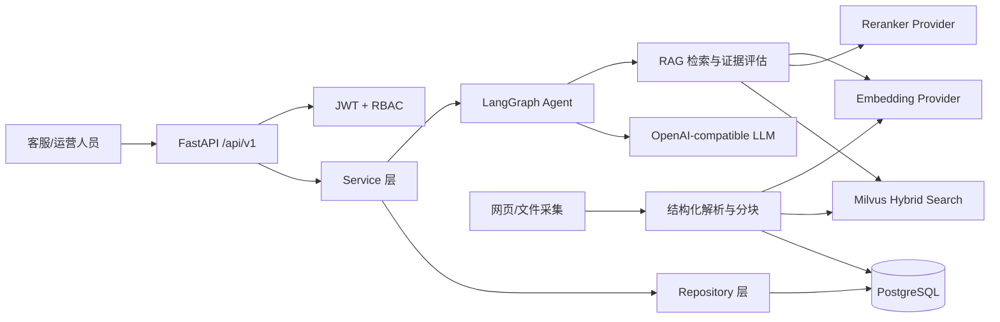
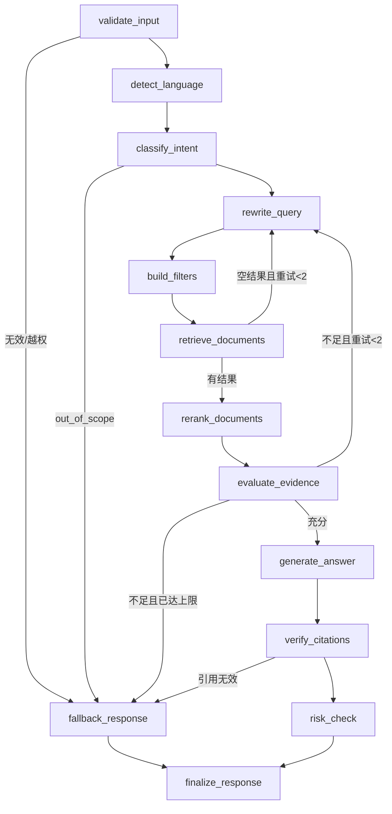

# TraceCommerce RAG Agent 架构设计

## 1. 设计目标

TraceCommerce RAG Agent 面向跨境电商客服与运营人员，使用 Shopify 官方帮助中心和本地企业文档作为知识来源。系统必须在证据充分时回答，并返回原文片段、来源 URL、检索分数、请求追踪 ID 和 Agent 节点轨迹；证据不足时统一返回知识不足提示。

核心边界：

- FastAPI 只处理协议、鉴权、参数校验和响应转换。
- Service 层编排业务，Repository 层负责 PostgreSQL 数据访问。
- LangGraph 负责任务状态、条件分支、重试和短期会话记忆。
- RAG 层负责查询处理、Embedding、混合检索、Rerank、证据判断和引用校验。
- Milvus 保存 Chunk 向量与检索元数据；PostgreSQL 保存业务实体、会话和审计数据。
- LLM、Embedding、Reranker 和 VectorStore 都通过接口隔离，测试不依赖外部模型。

## 2. 系统架构

## 3. 请求主链路

1. 中间件生成或接收 `request_id`，记录结构化访问日志。
2. JWT 解析当前用户，RBAC 校验客服、运营或管理员权限。
3. ChatService 创建/获取会话并构建 AgentState。
4. LangGraph 执行输入校验、语言识别、意图分类、Query 改写和 Metadata Filter。
5. Retriever 调用 Milvus Dense + Sparse 混合检索；2.5+ 使用 BM25，2.4 使用词法 Sparse IP。
6. Reranker 精排，EvidenceEvaluator 判断证据是否充分。
7. 最多重新改写和检索两次；仍不足则进入 fallback。
8. LLM 只根据检索上下文生成答案，CitationBuilder 从真实 Chunk 构造引用。
9. CitationVerifier 检查引用片段确实来自检索文档；失败时 `grounded=false`。
10. 请求、检索结果、引用和节点轨迹写入 PostgreSQL。

## 4. PostgreSQL 表设计

所有主键使用 UUID，主要业务表包含 `created_at`、`updated_at` 和 `is_active` 或软删除字段。

| 表 | 关键字段 | 用途 |
|---|---|---|
| roles | id, name, description | admin/customer_service/operator |
| users | id, email, password_hash, display_name, is_active | 用户账户 |
| user_roles | user_id, role_id | 多对多 RBAC |
| knowledge_sources | id, name, company_name, source_type, base_url, config, last_synced_at | 网页或本地知识源 |
| documents | id, source_id, title, source_url, language, category, content_hash, current_version | 文档主记录 |
| document_versions | id, document_id, version, raw_content, content_hash, crawled_at | 增量版本 |
| ingestion_jobs | id, source_id, status, counters, error | 导入任务 |
| conversations | id, thread_id, user_id, title | 会话 |
| messages | id, conversation_id, request_id, role, content, metadata | 消息 |
| rag_requests | id, request_id, thread_id, user_id, query, intent, language, evidence_score, evidence_level, confidence, grounded | RAG 请求 |
| retrieval_records | id, rag_request_id, document_id, chunk_id, scores, rank | 检索记录 |
| citations | id, rag_request_id, document_id, chunk_id, quoted_text, source_url, scores | 引用 |
| agent_traces | id, rag_request_id, node, status, duration_ms, summaries, error | 节点追踪 |
| answer_feedback | id, rag_request_id, user_id, helpful, comment | 用户反馈 |
| audit_logs | id, user_id, request_id, action, resource_type, resource_id, details | 审计日志 |

关键索引：

- users.email 唯一索引
- roles.name 唯一索引
- conversations.thread_id 唯一索引
- rag_requests.request_id 唯一索引
- documents(source_id, source_url) 唯一索引
- documents(content_hash)、document_versions(document_id, version)
- citations(rag_request_id)、agent_traces(rag_request_id)

## 5. Milvus Collection Schema

Collection 名称默认 `tracecommerce_chunks`。

| 字段 | 类型 | 说明 |
|---|---|---|
| id | VARCHAR, Primary | 向量记录 ID |
| chunk_id | VARCHAR | Chunk UUID |
| document_id | VARCHAR | 文档 UUID |
| source_id | VARCHAR | 知识源 UUID |
| company_name | VARCHAR | 企业名称 |
| title | VARCHAR | 文档标题 |
| section_title | VARCHAR | 章节标题 |
| source_url | VARCHAR | 原始 URL |
| content | VARCHAR + analyzer | 原始 Chunk，用于回答和 BM25 |
| language | VARCHAR | zh-CN/en 等 |
| country_or_region | VARCHAR | 国家或地区 |
| business_category | VARCHAR | 业务分类 |
| source_type | VARCHAR | website/pdf/txt/markdown/html/docx |
| version | INT64 | 文档版本 |
| is_active | BOOL | 是否参与检索 |
| crawled_at | VARCHAR | 采集时间 |
| dense_vector | FLOAT_VECTOR | 稠密向量，维度运行时读取 |
| sparse_vector | SPARSE_FLOAT_VECTOR | 2.5+ 由 BM25 Function 生成；2.4 由适配器生成 |

索引：

- dense_vector: HNSW + COSINE
- sparse_vector: 2.5+ 使用 SPARSE_INVERTED_INDEX + BM25；2.4 使用 IP
- Hybrid Search: WeightedRanker，默认 Dense 0.7 / Sparse 0.3

## 6. LangGraph State

`AgentState` 包含：

- request_id, thread_id, user_id, role
- original_query, rewritten_query, language, intent, region, filters
- retrieved_documents, reranked_documents, evidence_score, evidence_level
- answer, citations, grounded, risk_flags
- execution_trace, warnings, retry_count, error

`evidence_score` 是由 Reranker Top-1 与 Top-3 均值组合得到的启发式匹配分，
不是答案正确概率；`evidence_level` 提供 insufficient/low/medium/high 四档展示。
旧字段 `confidence` 仅用于 API 向后兼容。

## 7. LangGraph 节点和分支

## 8. 分阶段开发计划

1. 脚手架：配置、日志、中间件、FastAPI、Docker Compose、健康检查。
2. 认证与数据库：SQLAlchemy、Alembic、JWT、bcrypt、RBAC。
3. 知识导入：安全爬虫、文件解析、结构分块、Embedding、Milvus、增量版本。
4. 基础 RAG：混合检索、Metadata Filter、Reranker、证据判断、引用。
5. LangGraph：完整节点、分支、重试、记忆、执行追踪。
6. API、测试和文档：全部接口、Fake 组件、pytest、README、启动脚本和端到端验证。

## 9. 主要技术风险与处理

- Shopify 页面结构变化：解析器以语义标签和正文容器为主，保留原始文本降级策略。
- robots/访问限制：启动前检查 robots.txt，固定 User-Agent、超时、1 秒间隔、页面和深度上限。
- SSRF：仅允许 HTTPS 白名单域名，DNS 解析后拒绝私网、回环和链路本地地址。
- BGE 模型资源消耗：延迟加载、批量处理、测试使用 FakeEmbedding/MockReranker。
- Milvus 版本差异：VectorStore 自动检测版本，兼容本机 2.4 Sparse IP 和 2.5+ BM25。
- LLM 幻觉：证据阈值、严格上下文提示、真实引用构造、引用校验和 fallback。
- 跨语言召回：默认 BGE-M3，并保留语言和地区 Metadata Filter。
- 重试死循环：State 中保存 `retry_count`，最大两次。
- 本地部署边界：FastAPI/Python 在 PyCharm 运行，Docker 只承载 PostgreSQL 与 Milvus。
